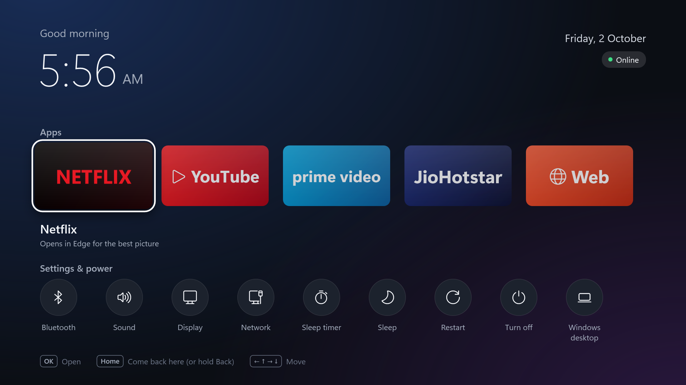

# CouchTV

CouchTV turns a Windows mini PC into a TV box. The PC starts straight into a full-screen home screen with big tiles (Netflix, YouTube, Prime Video, JioHotstar, the web) that you drive with a remote. You never see the Windows desktop, Start menu, taskbar or notifications, and ads are blocked where a browser can block them.



---

## The plan, and why it isn't a brand-new OS

The slow start and the clutter come from the Windows *desktop layer*: Explorer, the taskbar, tray apps and everything that launches at sign-in. The kernel and drivers underneath are fine, and they're the part that makes your Ethernet, Bluetooth dongle and GPU work. So CouchTV replaces only that top layer. This is the same idea as Android TV, which is a TV launcher running on top of Android.

I looked at swapping the whole OS. Every alternative loses on the thing you're about to pay for, which is Netflix:

| Option | Netflix on this PC | Ad blocking | Verdict |
|---|---|---|---|
| **Windows + CouchTV** (this) | **Full HD** in Edge, or 4K with a 4K screen and a recent GPU. Officially supported. | Brave Shields for YouTube and free sites | Best picture, keeps all your drivers, fully reversible |
| Android-x86 / Bliss OS ("Android box" feel) | Netflix refuses devices that aren't Google-certified, which a PC can't be. Where it does run, users report no HD. | YouTube needs extra apps | Looks right, but Netflix often won't play |
| ChromeOS Flex | Web only (Flex has no Play Store), and Netflix keeps its best quality for real Chromebooks | Chrome extensions only | No Brave, no Android apps |
| Linux / LibreELEC (Kodi) | 1080p at best, which Netflix says it "can't guarantee" | Brave works | Fastest boot, but Netflix is unsupported |

If you ever want the genuine Android TV experience, a ₹3,000–5,000 streaming stick is certified for full-HD Netflix and beats putting Android on a PC. For this PC, Windows + CouchTV is the best fit.

## What the installer changes

- **Boots straight into CouchTV.** It becomes the Windows "shell" for your user, so Explorer, the taskbar and all start-up apps (OneDrive, Teams, tray icons) never load. That is faster and there's nothing to click by mistake.
- **The power button sleeps instead of shutting down**, like a TV's standby. Waking takes about 2 seconds. A cold boot takes 15–30 seconds even on a fast SSD.
- **No password on wake, and (optionally) automatic sign-in**, so you go from power button to home screen with no typing.
- **Volume keys show a TV-style volume bar.** Windows normally draws that, but its usual code isn't running in TV mode.
- **No pop-ups.** Notifications, "finish setting up your PC" screens and Windows Update restarts between 8 AM and 2 AM are switched off.
- **Browser clean-up.** Edge and Brave skip their welcome, sign-in and sync screens, sidebars and crypto/VPN/AI prompts, and quit fully when you leave an app.

Everything is undone by `Uninstall-CouchTV.cmd`.

---

## Install (about 10 minutes)

1. **Copy this folder to the TV PC.** If both PCs use the same OneDrive account it is already there; otherwise use a USB stick.
2. *(Optional)* Double-click **`Try-CouchTV.cmd`** to preview CouchTV full screen without installing anything. Press Alt+F4 to close it.
3. Double-click **`Install-CouchTV.cmd`** and click **Yes** when Windows asks for administrator rights.
   - Run it while signed in to the account the TV should use. TV mode only applies to that account.
   - When it asks about **automatic sign-in**, say yes. A small Microsoft tool (Sysinternals Autologon) opens: type your Windows password and click *Enable*. For a Microsoft account, use the account password, not your PIN.
4. Restart. The PC now starts into CouchTV.
5. **First run:** open Netflix, Prime Video and JioHotstar once each and sign in, **ticking "Remember me"**. CouchTV's TV windows keep remembered logins but forget the rest when they close. YouTube and Web use your normal Brave, where you're probably signed in already.

> **Plug in the remote's USB receiver before installing.** The installer lets USB keyboards and remotes wake the PC from sleep, and it can only see devices that are connected. If you buy the remote later, run the installer again.

## Using it

| Press | What happens |
|---|---|
| Arrow keys / remote D-pad | Move between tiles |
| OK / Enter | Open the tile |
| **Home** (house button), **hold Back**, or tap the Windows key | Close the app you're in and return to the home screen |
| Back | Go back inside the app (browser back) |
| Volume / Mute | Change volume, with an on-screen bar |
| Power button (PC, or remotes whose power key sends Sleep) | Sleep / wake |
| Air-mouse pointer or touchpad | Point and click works everywhere, including on tiles. A click right after using the arrows counts as OK. |
| 🎤 on the phone remote, or F3 / a Search key | Search (see *Search* below) |
| F5 on the home screen | Reload `couchtv.ini` after editing it |
| F6 on the home screen | Check for a CouchTV update now |

The **Settings & power** row has:

- **Bluetooth**: Windows' *Add a device* wizard, for pairing headphones and speakers.
- **Sound**: the classic Sound panel, to choose between speakers and headphones.
- Display and Network.
- **Remote**: set up an infrared remote (see *Remote* below). F2 also opens it.
- A **sleep timer** (30/60/90/120 min; press it again to change it).
- Sleep, Restart, Turn off and *Windows desktop*.

When Windows has installed an update, the Restart button shows an orange dot and reads *Restart to update*.

Display and Network open Windows' Settings app, which only runs while the desktop is running. In TV mode, CouchTV starts the desktop in the background first, which takes a few extra seconds. Restart to go back to TV-only mode.

*Windows desktop* opens the normal desktop for maintenance (installing things, file management). Press Home to come back to CouchTV, and restart to return to pure TV mode.

### Search

1. **Tap the blue mic** at the top of the phone remote and say what you want to watch, for example *"Panchayat season 3"*. While the phone listens, the TV shows *Listening…* and turns its sound down, even over a playing show. Hindi works too: tap the language button on the phone's listening screen.
2. **The words appear on the TV** about a second later. Keep the phone pointed at the TV while they're sent.
3. **Pick where to search** (Netflix, YouTube, Prime Video, JioHotstar or Web) and press OK. That app opens on its own search results.

To type instead, tap the search bar on the phone, or press F3 on a keyboard and type. Back closes search and returns to whatever was playing.

**AI search** works out what you mean instead of always offering the same row:

| You say | What happens |
|---|---|
| *"panchayat ka season 3 lagao"* | Finds the series, checks where it streams in India (Prime Video) and **opens it by itself** after a 2-second countdown. Press Back during the countdown to choose something else. |
| a show or film on **Netflix** (your subscription) | Opens it on Netflix, even if other apps have it too |
| one that isn't on Netflix | Prime Video or JioHotstar, if they have it (some of their titles are free; the card says *Needs a subscription* or *Free with ads*). If both have it, you choose. |
| one it can't place | Searches Netflix for it |
| *"play some music"*, *"arijit singh ke gaane"* | **Plays** on YouTube straight away: it picks the top song and keeps going with a mix of similar songs |
| *"mr beast ka latest video"* | Plays his newest upload |
| *"cooking videos dikhao"* | Shows YouTube's results, since you asked to look through them |
| *"netflix kholo"* | Opens Netflix |
| *"aadhe ghante baad TV band kar do"* | Sets the sleep timer to 30 minutes |

One clear answer opens by itself; two or more wait for you. Your other apps always stay at the end of the row, and for something that plays, *All results* shows YouTube's search instead. A YouTube video goes full screen a few seconds after it opens; if it doesn't, press Full screen on the phone.

It needs two free keys, which stay on the TV PC (in `%LOCALAPPDATA%\CouchTV\keys.ini`), never in this repo:

1. **Gemini** (understands the words): at [aistudio.google.com/apikey](https://aistudio.google.com/apikey), sign in with Google and choose **Create API key**. The free tier allows about 1,000 searches a day. Google may use free-tier requests to improve its models; here those are only your search words.
2. **TMDB** (says which app has a show or film): make an account at [themoviedb.org](https://www.themoviedb.org/signup), then **Settings → API → Create**, choose *Developer*, and copy the **API Key** (32 letters and digits).
3. **Give them to the TV:** on the phone remote, tap the search bar, paste a key and tap Search. The TV recognises it and asks *Save this key?*. Do the same for the other one.

Without keys, search still works: songs and videos go to YouTube, *"… on netflix"* searches Netflix, and everything else shows the plain app row. Your subscriptions are listed in `couchtv.ini` as `Subscriptions = Netflix`; add others there (for example `Netflix, JioHotstar`) when you subscribe. YouTube is used for music and videos, never for shows and films. Where-to-watch data comes from JustWatch, via TMDB. The phone does the speech recognition (Google's, the same as Android's voice typing), and the receiver needs no change. How the words travel over infrared is in [ir-receiver/PROTOCOL.md](ir-receiver/PROTOCOL.md#text-voice-search).

## Make it start fast

1. **Use Sleep, not Turn off.** The remote's power button already does this after installing. Android boxes feel instant for the same reason: they almost never actually boot.
2. **Check that it has an SSD.** In Task Manager → Performance → Disk, it should say *SSD*. If it says *HDD*, a ₹1,500–2,500 SSD is the biggest speed-up you can buy, bigger than anything software can do.
3. **BIOS settings** (press Del or F2 while it starts): turn on *Fast Boot*, turn off *Network/PXE boot*, and enable *USB wake from S3/S4* (sometimes called *Wake on USB*, or disable *ErP*) so the remote can wake it.
4. **Automatic sign-in** (the installer offers it).

---

## Customise: `C:\CouchTV\couchtv.ini`

Open it in Notepad, save, and press **F5** on the home screen. Every option is explained at the top of the file. Common changes:

**Add a tile**, for example a site you watch:

```ini
[Hoichoi]
Type = web
Url = https://www.hoichoi.tv
Browser = edge
Background = #E21D2E
Foreground = #FFFFFF
```

- **Hide a tile:** add `Enabled = false`. SonyLIV, ZEE5, Spotify and *YouTube for TV* tiles are included but hidden.
- **YouTube made for the remote:** set `Enabled = true` on the *YouTube for TV* tile. It's YouTube's TV interface, where you use the arrows and OK instead of pointing. Brave's built-in blocker misses its ads, though, so it's best paired with YouTube Premium Lite.
- **Use your own tile art:** put a PNG in `C:\CouchTV\icons\` and add `Image = icons\name.png`.
- **Bigger text on a website** (helpful from the sofa): `Scale = 1.25`.
- **Search in another app:** add its search address to the tile, with `{q}` where the words go, for example `Search = https://example.com/search?q={q}`. `Search = off` leaves a tile out of search.
- **Remote's Home button does nothing?** Add the key it sends to `HomeKeys` in the `[CouchTV]` section, for example `HomeKeys = BrowserHome, Win, Hold:BrowserBack, F12`.
- **Wallpaper:** `Wallpaper = C:\Users\Public\Pictures\beach.jpg`.
- A Kodi tile appears by itself if Kodi is installed. The VLC tile is hidden; set `Enabled = true` in its section to bring it back.
- **Settings changes from updates:** updates never replace your `couchtv.ini`. When a new version changes a default (like hiding VLC), it applies that change to your file once and records `ConfigVersion`; if you change it back, your choice stays.

**Which browser for what:** paid services (Netflix, Prime Video, JioHotstar) open in **Edge**. Edge is Netflix's best-supported Windows browser (up to 4K with HDR), while Brave isn't on Netflix's supported list, and paid plans have no ads for Brave to block anyway. Free, ad-supported sites (YouTube, the web) open in **Brave**, whose Shields block the ads.

---

## Streaming: what to pay for

*India prices, checked 2 October 2026.*

Netflix is a good call, and much better than pirate sites. Those sites earn their money from malicious ads and fake download buttons, and their servers disappear without warning. Legal streaming in India is cheap if you are choosy:

| Service | Ad-free option | Price | Watch out for |
|---|---|---|---|
| **Netflix** | Standard: 1080p, 2 screens | ₹499/month | No ads on any Netflix plan in India. **Don't buy Mobile (₹149):** Netflix blocks it on PCs and TVs. Basic (₹199) is 720p; Premium (₹649) adds 4K. |
| **JioHotstar** | Premium: up to 4K, 4 screens | ₹299/month or ₹2,199/year | Only Premium is ad-free, and live sports still carry ads. The ₹79 Mobile plan doesn't work in a browser. |
| **Prime Video** | Prime plus the ad-free add-on | ₹1,499 + ₹699 per year | Prime has shown ads since June 2025 unless you buy the add-on. Computers get HD, not 4K. |
| **YouTube** | Premium Lite / Premium | ₹89 / ₹149 per month | Optional, since Brave already blocks ads on the normal site. Lite removes ads from most videos (not music or Shorts), including in the remote-friendly *YouTube for TV* tile. |

What I'd do:

1. **Rotate instead of stacking.** None of these has a contract. Take one service for a month or two, watch what you wanted, cancel, and switch. One subscription at a time costs less than a cable connection.
2. **Pick by what you watch.** Netflix for international series and films. JioHotstar Premium for Indian TV serials, HBO and Disney shows, and cricket, though sports have ads on every plan.
3. **Check your broadband plan.** Indian fibre plans (JioFiber, Airtel Xstream and others) often bundle these subscriptions for less.
4. **Keep Brave for YouTube.** If YouTube's ad-blocker crackdowns get annoying, or you want the remote-friendly TV interface without ads, Premium Lite at ₹89 covers both.

## Remote: your phone, plus any IR remote

CouchTV works with **any infrared remote** through **CouchIR**, a ₹500 USB receiver you build in about 15 minutes with no soldering. That includes the remote app for your Mi phone's IR blaster, an old TV remote, or one you buy later.

- **Shopping list:** everything is from one store, quartzcomponents.com, for about ₹516 including free shipping.
- **Build guide:** wiring and firmware are in **[ir-receiver/README.md](ir-receiver/README.md)**.
- **Teaching it a remote:** open **Settings & power → Remote** (or press F2) and press each button when asked. Mappings are saved in `C:\CouchTV\remote.ini`, and several remotes can be set up at once.
- **The phone remote app** for Mi phones with an IR blaster is in **[phone-remote/](phone-remote/README.md)**: open it in Android Studio and press Run. Its codes are already mapped, so it works with no setup. The signal format is in [ir-receiver/PROTOCOL.md](ir-receiver/PROTOCOL.md).
- **Waking from sleep:** buttons you map to **Power** are stored on the receiver, so they can wake the PC from sleep.

Inside apps, remote buttons act as real keys (arrows, Enter, Back, Space for play/pause), so they work in Netflix and YouTube too. Holding Back goes Home, and there are buttons that jump straight into a tile.

---

## Updates

CouchTV keeps itself up to date from the `main` branch of [github.com/charan-mudiraj/CouchTV](https://github.com/charan-mudiraj/CouchTV).

- **Push to `main`, and the TV notices.** It checks every 10 minutes and shortly after waking from sleep. The header then shows *Update available*, an **Update** tile appears at the front of Settings & power, and a short message names the commit. Press **F6** on the home screen to check straight away.
- **Select Update and confirm.** CouchTV downloads that commit, builds it on the TV and test-draws the new home screen before anything is replaced. Then it restarts into the new version (the screen goes dark for a few seconds) and tells you what changed.
- **It's safe to press.** If the download or build fails, nothing changes. If installing the files fails, the previous version is put back automatically. Details are in `%LOCALAPPDATA%\CouchTV\update.log`.
- **Your settings stay yours.** `couchtv.ini` and `remote.ini` are never overwritten. Each update saves the new defaults next to them as `couchtv.default.ini` and `remote.default.ini`, so you can copy new options across.
- **Only CouchTV itself updates.** If a change touches the installer (Windows settings, browser policies), run `Install-CouchTV.cmd` again.
- The installed commit is in `C:\CouchTV\version.txt`. Set `Updates = off` in `couchtv.ini` to stop checking, or use `UpdateRepo` / `UpdateBranch` to follow a fork or another branch.
- Anyone who can push to `main` can change what runs on the TV, so keep two-factor sign-in on your GitHub account.
- **The phone remote app updates itself the same way:** when `phone-remote/` changes on `main`, GitHub builds a new APK and the app offers it the next time you open it. See [phone-remote/README.md](phone-remote/README.md#updates) for the one-time signing-key setup.

---

## Troubleshooting and undo

- **Black screen after restarting.** Press **Ctrl+Shift+Esc** to open Task Manager, choose **Run new task**, type `C:\CouchTV\Uninstall-CouchTV.cmd` and press Enter. Typing `explorer` instead brings the desktop back for this session only. For extra safety, keep a second administrator account on the PC: TV mode only applies to the account you installed it for.
- **The desktop appears for a few seconds before CouchTV.** Windows ignored the shell setting, so CouchTV is starting in its fallback mode on top of the desktop. Everything still works; start-up is just slower.
- **The *YouTube for TV* tile shows ads.** That's expected: Brave's built-in blocker misses ads on YouTube's TV interface. Use the normal YouTube tile, or YouTube Premium Lite.
- **The *YouTube for TV* tile shows the normal website.** Google sometimes changes which devices its TV page accepts. Try the other user agent listed above that tile in `couchtv.ini`.
- **Netflix looks soft.** Check that the tile says *Opens in Edge*, and that your plan includes 1080p. Basic is 720p, and the Mobile plan doesn't work on a PC at all.
- **An IR remote button does nothing.** Open **Remote** in Settings & power. If the top right says *Receiver not found*, re-plug the receiver and close any Arduino Serial Monitor (only one program can use it). Otherwise run Remote setup again for that button.
- **A USB remote or keyboard button does nothing.** See the `HomeKeys` tip above. `C:\CouchTV\CouchTV.exe --selftest report.txt` writes a report of what CouchTV detects, and the log is at `%LOCALAPPDATA%\CouchTV\couchtv.log`.
- **Uninstall:** run *Exit TV mode* from the Start menu (in desktop mode) or `C:\CouchTV\Uninstall-CouchTV.cmd`, then restart. It removes everything the installer set, and asks before deleting files and saved logins.

## How it works

- `ir-receiver/` has the CouchIR receiver firmware (Arduino), its build guide and the phone remote's signal format. CouchTV talks to the receiver over USB serial: it finds it by itself, reconnects after sleep or unplugging, and turns each button into a key press or action.
- Updates: `src/AppUpdate.cs` checks GitHub's API for the newest commit (only offering commits newer than the installed one), then downloads, builds and start-checks it; `scripts/apply-update.ps1` swaps the files after CouchTV exits and rolls back on failure. `CouchTV.exe --updatetest report.txt [--prepare]` exercises all of that without installing.
- `src/` holds a small WPF app (C#), compiled on the PC by the C# compiler that ships inside Windows. Nothing gets downloaded and there is no runtime to install. It uses about 110 MB of RAM, less than Explorer and the start-up apps it replaces.
- The installer registers it as the shell for your user only (`HKCU\...\Winlogon\Shell`), plus a sign-in fallback. If CouchTV ever crashes, it starts the normal desktop so you're never stuck.
- Web tiles open as full-screen browser "app" windows (no tabs or address bar). The paid services share a separate CouchTV profile in Edge, while YouTube and Web use your normal Brave profile. CouchTV deliberately avoids Edge's *kiosk* mode, which browses privately and would log you out of Netflix every time.
- In TV mode, the Home key closes the open app window, the way a TV leaves an app, then shows the home screen.
- `scripts/build.ps1` builds it, `scripts/install.ps1 -DryRun` previews every change without making it, and `CouchTV.exe --screenshot out.png` renders the home screen to an image.
