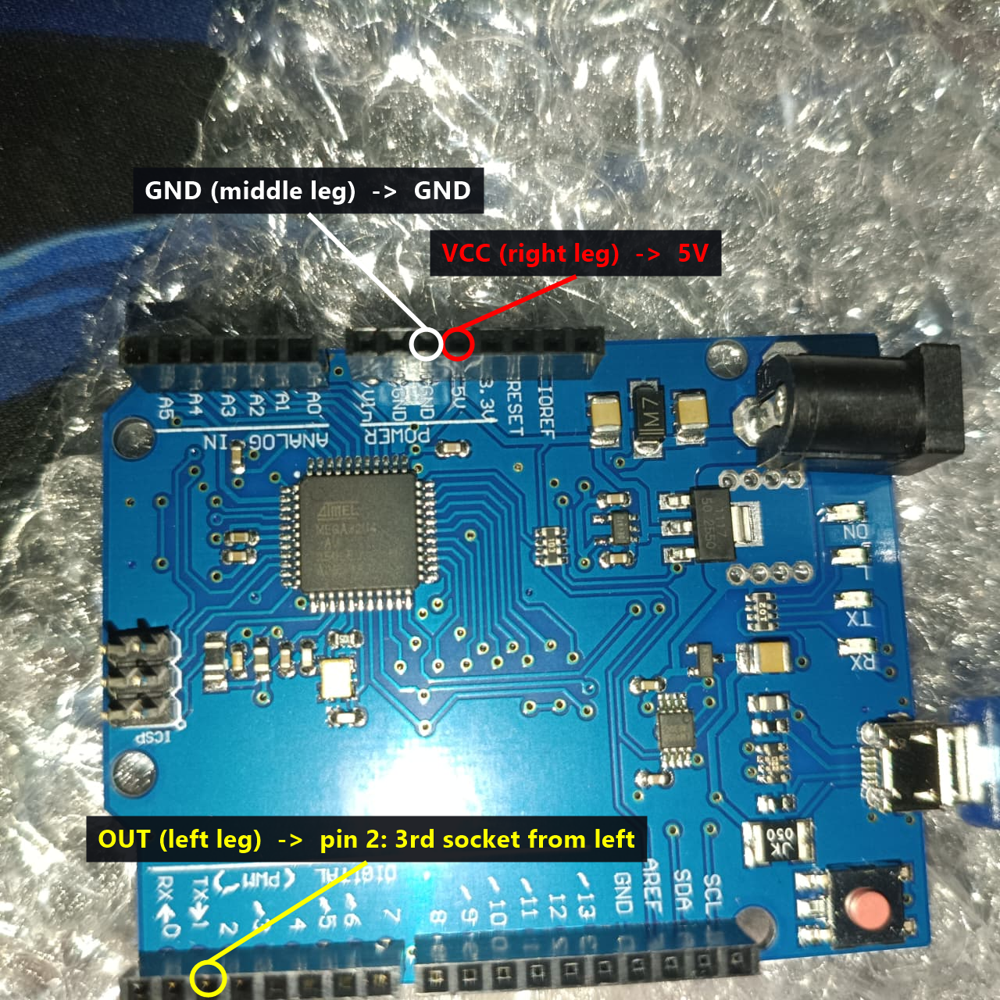

# CouchIR: a universal remote receiver for CouchTV

A ₹500 USB gadget that lets **any infrared remote** control CouchTV: the phone remote app we're building for your Mi phone, an old TV remote, or one you buy later. It plugs into the TV PC like a keyboard (no drivers). CouchTV's **Remote setup** screen teaches it each button, and you can set up as many remotes as you like.

How it works:

1. The receiver decodes every button press and sends the PC a code that is unique to that button, like `Samsung 0707 0060`. It understands NEC, Samsung, Sony, LG, RC5/RC6, Panasonic, JVC, Denon, Sharp, Apple and most others, through a universal decoder.
2. CouchTV looks the code up in `remote.ini` and acts: arrow keys into Netflix, volume, Home, open a tile, sleep...
3. Buttons you map to **Power** are also stored on the receiver itself, so they can wake the PC from sleep (CouchTV can't listen while the PC is asleep).

---

## Shopping list: everything from one store, no soldering

All from **[quartzcomponents.com](https://quartzcomponents.com)**. Prices as listed on 3 October 2026, and the total is just over their ₹500 free-shipping threshold.

| | Part | Price |
|---|---|---|
| ✅ | [Leonardo R3 board (ATmega32U4, micro-USB)](https://quartzcomponents.com/products/leonardo-r3-board-1) | ₹415 |
| ✅ | [TSOP1838 IR receiver](https://quartzcomponents.com/products/tsop1838-ir-receiving-head), **buy 2** (one spare) | ₹7 each |
| ✅ | [Male-to-female jumper wires, set of 10](https://quartzcomponents.com/products/male-to-female-connecting-wires-jumper-wires-set-of-10) | ₹16 |
| ✅ | [USB to micro-USB cable](https://quartzcomponents.com/products/raspberry-pi-cable-for-charging) | ₹27 |
| ✅ | [USB extension cable, 60 cm](https://quartzcomponents.com/products/usb-cable-male-to-female-60cm-1amp), so the board can sit where the sensor can see the sofa | ₹34 |
| optional | [100 Ω resistors, pack of 10](https://quartzcomponents.com/products/100-ohm-1-4-watt-resistor) + [4.7 µF capacitor](https://quartzcomponents.com/products/4-7uf-50v-electrolytic-capacitor): a power filter, only if you get phantom presses | ₹7 + ₹3 |
| | **Total** | **≈ ₹516** |

- **Better sensor:** if Quartz's [TSOP38238](https://quartzcomponents.com/products/tsop38238-ir-receiver-diode-38khz) (₹12, genuine Vishay part, longest range) is back in stock, get it instead of the TSOP1838. It was out of stock on 3 October. The ₹7 TSOP1838 is a generic copy, but it works fine at living-room distances.
- **Want it tiny instead?** Robocraze's [Pro Micro (₹419)](https://robocraze.com/products/pro-micro-5v-mini-leonardo-compatible-with-arduino) is the same chip on a thumb-sized board. Its header pins usually need **soldering**, and Robocraze has no capacitor or USB extension cable, so it means two orders. The Leonardo is the easier first build.
- **Don't buy a "Pro Mini"** by mistake: different chip, no USB.

## Wiring (three wires)

Hold the sensor with its **dome facing you** and the legs pointing down. On both the TSOP1838 and the TSOP38238, the legs are, from left to right, **OUT, GND, VCC**.

```
        .---.
       ( dome )        sensor, dome facing you
        '---'
        | | |
      OUT GND VCC
        |  |   |
        |  |   '------------  5V     on the Leonardo   (VCC on a Pro Micro)
        |  '----------------  GND
        '-------------------  2      (digital pin 2)
```

Push the jumpers' **female** ends onto the sensor's legs and the **male** ends into the board's `2`, `GND` and `5V` sockets.



> Getting VCC and GND the wrong way round can kill the sensor. That's why the list says buy two. Some other parts (for example the TSOP1738) have a different pin order, so check the product picture if you buy elsewhere.

**Optional power filter** (Vishay's recommended circuit, which helps if the PC's USB power is noisy): put the 100 Ω resistor between `5V` and the sensor's VCC leg, and the 4.7 µF capacitor between the sensor's VCC leg and GND. The capacitor's stripe (−) goes to GND.

## Put the firmware on it (10 minutes, any PC)

1. Install the **Arduino IDE 2** from [arduino.cc/en/software](https://www.arduino.cc/en/software).
2. Plug the board in. Choose **Tools → Board → Arduino AVR Boards → Arduino Leonardo** (use this for the Pro Micro too), then **Tools → Port** and pick the new COM port.
3. Open **Tools → Manage Libraries**, search for **IRremote** and install *IRremote by shirriff, z3t0, ArminJo* (version 4.x). The *Keyboard* library is already built in.
4. **File → Open** `ir-receiver/firmware/CouchIR/CouchIR.ino`, then press **Upload** (the → button). It uses about half of the board's memory. If the upload hangs on a clone board, press the board's reset button once when the IDE says "Uploading...".
5. **Test it:** open **Tools → Serial Monitor**, set it to **115200 baud** and **New Line**, then press buttons on any remote. You should see lines like `IR,NEC 0004 0040,N`, and the board's RX light blinks for each one. Type `?` and press Enter: it answers `COUCHIR 1 0`. Close the Serial Monitor afterwards, because only one program can use the receiver at a time.

## Use it with CouchTV

1. Plug the receiver into the TV PC. CouchTV finds it by itself.
2. Open **Settings & power → Remote** (or press **F2** on the home screen). The top right says *Receiver ready on COMx*.
3. Press each button on your remote when asked. Use **Skip** (Backspace) for buttons your remote doesn't have. Optional steps at the end give remote buttons that jump straight into Netflix, YouTube and the other tiles.
4. Repeat for every remote you own. They all work at the same time.

The CouchTV phone remote needs no setup: its buttons are already in `remote.ini` (see [PROTOCOL.md](PROTOCOL.md)).

**To wake the PC with the remote:** set up a Power button, then re-run `Install-CouchTV.cmd` with the receiver plugged in. That allows it to wake the PC. Also turn on *USB wake* in the BIOS (see the main README). Only buttons mapped to Power wake it, so a different remote in the room won't switch the TV on.

## Getting clean, reliable reception

- **The sensor must see the sofa.** The PC sits behind the monitor, so put the board on the USB extension and tape the sensor at the bottom edge of the monitor, dome facing the room. Longer [30 cm jumpers](https://quartzcomponents.com/products/male-to-female-connecting-wires-jumper-wires-30cm-set-of-40) (₹49) also help.
- **Keep it out of direct sunlight and away from bright lamps right next to it.** Both are infrared noise.
- **Phone IR blasters are weaker than real remotes:** expect 3–6 m. Point the top edge of the phone at the TV.
- **Phantom presses or missed presses:** add the optional power filter, or swap to a TSOP38238.
- The receiver only accepts frames that pass the protocol's own checks, and CouchTV only acts on buttons you've set up, so other remotes and random noise are ignored.

## Which remotes work

Almost every **infrared** remote: TVs, set-top boxes, DVD players, AC remotes and cheap "IR remote" kits. It's tuned for 38 kHz and still picks up 36–40 kHz remotes (Philips RC5/RC6, Sony).

It doesn't work with **Bluetooth or radio remotes**, including most remotes that come with Android TV boxes and Fire TV sticks. To check: point the remote at your phone's camera and press a button. If you see the remote's tip flash purple on the screen, it's infrared.

## Files

- `firmware/CouchIR/CouchIR.ino`: the receiver's program. It's commented, and the serial commands are listed at the top.
- `PROTOCOL.md`: the codes and timing for the phone remote app.
- `../remote.ini`: which button does what (`C:\CouchTV\remote.ini` once installed).
